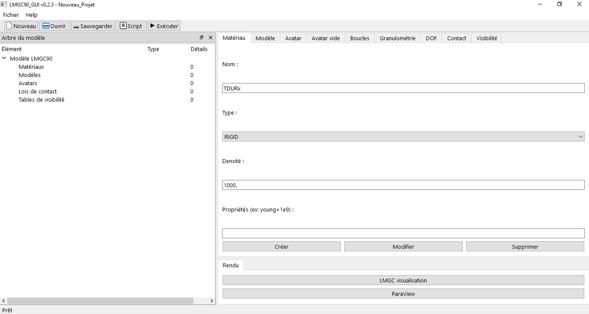

# LMGC90_GUI (Graphical User Interface for LMGC90) with PyQt6.

{width=600px height=400px}

This application is a PyQt6 graphical user interface intended for those who want to develop numerical models with pre-processor module (**pre**)of LMGC90 DEM code.

All versions are only for feasibility study, it will be completely rewritten in the future.

For use, you need to download PyQt6 and, of course, install LMGC90 on your machine.

## Installation

```bash
git clone https://github.com/bzerourou/LMGC90_GUI.git
cd LMGC90_GUI
python main.py
```

## Features of LMGC90_GUI :

In this first version,it is completely independant of the pylmgc90 library attributs (*lists* and *dicts*), you can create :  
- materials (RIGID, ELAS, ELAS_DILA, THERMO_ELAS, ELAS_PLAS, VISCO_ELAS, PORO_ELAS)
            <br>Options : density, young, nu, dilatation, T_ref_meca, conductivity, specific_capacity,
- models:  **2D** : Rxx2D, T3xxx, Q4xxx, T6xxx, Q8xxx, Q9xxx, BARxx.
           <br>**3D** : Rxx3D, H8xxx, SHB8x, H20xx, TE10x, BARxx.
           <br>Options : kinematic, formulation, mass_storage, anisotropy, external_model 
- avatars : **rigidDisk**, **rigidJonc**, **rigidPolygon**, **rigidOvoidPolygon**, **rigidDiscreteDisk**, **rigidCluster**, **roughWall**, **fineWall**, **smoothWall**, **granuloRoughWall**
- contact : Coulomb friction contact laws with  __'IQS_CLB'__, __IQS_CLB_g0__, and __'COUPLED_DOF__ type. 
- boundary conditions for avatar with :  **translate**, **rotate**, **imposeDrivenDof** and **imposeInitValue** functions.

The interface is easy to use and can save and open project with json formated file with extension (.lmgc90), and can generate and execute model script.

Since 0.1.9 version, you can edit and remove *models*, *materials*, *avatars*, *contacts* and *visibilities* elements.


This video is a short introduction to LMGC90_GUI
[Intro LMGC90_GUI](https://www.youtube.com/watch?v=Rn-ewPCuRuw)
<br>LMGC90_GUI v0.1.6
[LMGC90_GUI v0.1.6](https://www.youtube.com/watch?v=BLUeqLHGNXc&feature=youtu.be)


### List of version : 
-  0.1.0  : first version with `rigidDisk` avatar; 
-  0.1.1  : add `rigidJonc` avatar;
-  0.1.2 : add DOF function `imposeDrivenValue`;
-  0.1.3 : add `rigidPolygon` avatar and fix `rigidPolygon` generation type in QComboBox for `regular` and `full` values, numpy and math function can be used in QEditLine ;
-  0.1.4 : add rigidOvoidPolygon and fix some bugs;
-  0.1.5 : add `rigidDiscretDisk`, `roughWall`, `fineWall`, `smoothWall`, and `GranuloRoughWall` avatars;
-  0.1.6 : add parametric addition of avatars (circular, line, grid and spiral); 
-  0.1.7 : generate parametric avatars in loops, fix some bugs  ;
-  0.1.8 : add CRUD possibility for material, model, avatar, law and rule, fix some bugs; 
-  0.1.9 : add `manual` parametric add avatars, capability to store group of avatars in named list, fix some bugs;
-  0.2.0 : add `rigidCluster`, and new tab for `empty avatar`, add `'xKSID'`, `'JONCx'` and `'POLYG'` for visibility table, fix some bugs, **[stable version]** ;
-  0.2.1 : add `BARxx`, `T3xxx`, `T6xxx`, `T3xxx `, `Q4xxx`, `Q8xxx`, `Q9xxx`, `H8xxx`, `SHB8x`, `H20xx`, `SHB6x`, `TE10x`, and `DKTxx` models, add `PT2Dx`,`PT2DL`,`ALpxx`, `ASpxx`,`CLxxx`,`CSpxx` contactors ;
-  0.2.2 : Possibility to add new contactors for avatar in **emptyAvatar tab** ;
-  0.2.3 : add `IQS_CLB_go` and `COUPLED_DOF` contact laws; 
-  0.2.4 : add granulometry distribution and deposit in **Box2D** and **Disk2D** with *rigidDisk* avatar ;