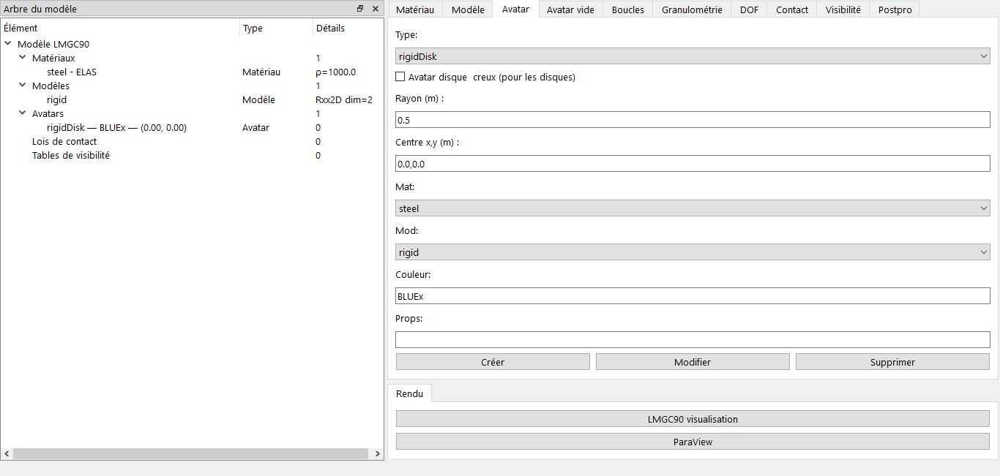

# Création d'un Avatar (Corps rigide simple)

Un avatar représente vos objets numériques qui seront en interaction les uns des autres, LMGC90 fournit plusieurs avatars rigides 2D/3D, seulement les 2D sont supportés.

## Types disponibles
LMGC90_GUI vous liste un nombre d'avatars qui sont déjà définit dans LMGC90: 
- rigidDisk
- rigidJonc (fondation)
- rigidPolygon (regular, full, bevel)
- rigidOvoidPolygon
- rigidDiscreteDisk
- rigidCluster
- roughWall, fineWall, smoothWall, granuloRoughWall (mur)

## Champs communs
Chaque avatar est caractérisé par son : 
- Type
- Centre (x,y) : coordonnées
- Matériau
- Modèle
- Couleur : sert aux interactions entre avatars

## Champs spécifiques par type

- Disque : rayon, si il est creux ou non
- Polygone : rayon + nb vertices OU liste de vertices
- Jonc : axe1, axe2
- Mur : longueur, rayon/hauteur, nombre de vertices

## Exemple 
Pour créer une avatar disque, il vous suffit seulement de préciser  : 
- rayon : 0.5, 
- coordonnées : [0.0, 0.0], 
- le matériau et modèle sont chargés automatiquement
- Cliquez ensuite sur le bouton *Créer*, 

## Astuces 
Chochez l'option 'Avatar disque creux' pour le rendre creux.