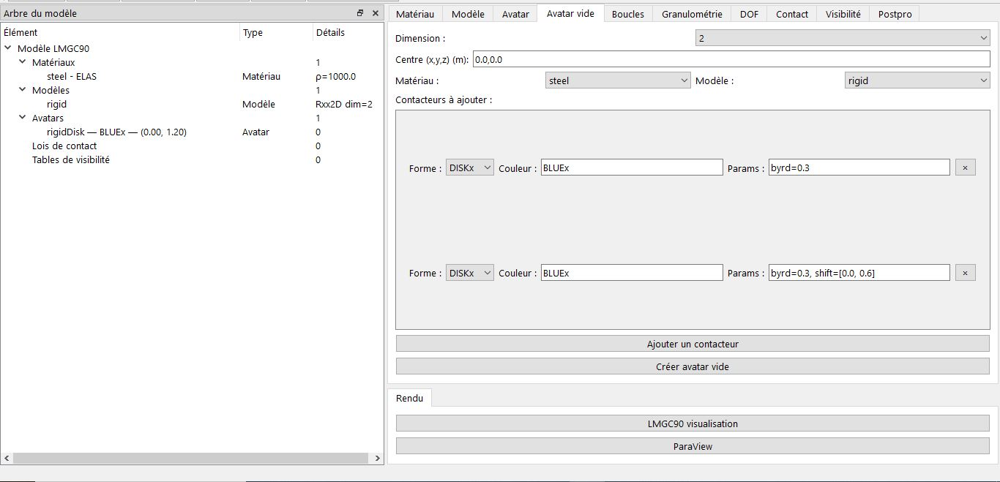

# Avatar Vide (Personnalisation avancée)

Cet onglet vous permi de créer des corps rigides avec plusieurs contacteurs.

## Fonctionnalités
- Ajout illimité de contacteurs
- Types de contacteurs supportés : DISKx, xKSID, JONCx, POLYG, PT2Dx
- Paramètres libres avec support des variables dynamiques

## Étapes
1. Choisir dimension (seulement en 2D)
2. Définir centre et couleur globale
3. Sélectionnez un matériau et un modèle
4. Cliquez sur le bouton  *"Ajouter un contacteur"* pour en rajouter un nouveau contacteur
5. Remplir la forme du contacteur souhaiter, la couleur, les paramètres seront chargés automatiquement par l'application
    - premier contacteur de type 'DISKx', le rayon : 0.3
    - le second contacteur de même type, le rayon : 0.3, je m'en sert de l'option *shift= [0.0, 0.6]* pour préciser les cooordonnées du deuxième contacteur
6. cliquez ensuite sur le bouton *"Créer avatar vide"*

