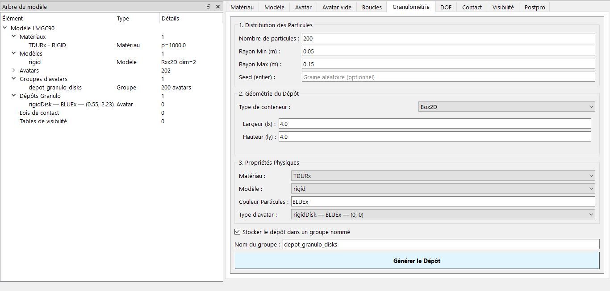
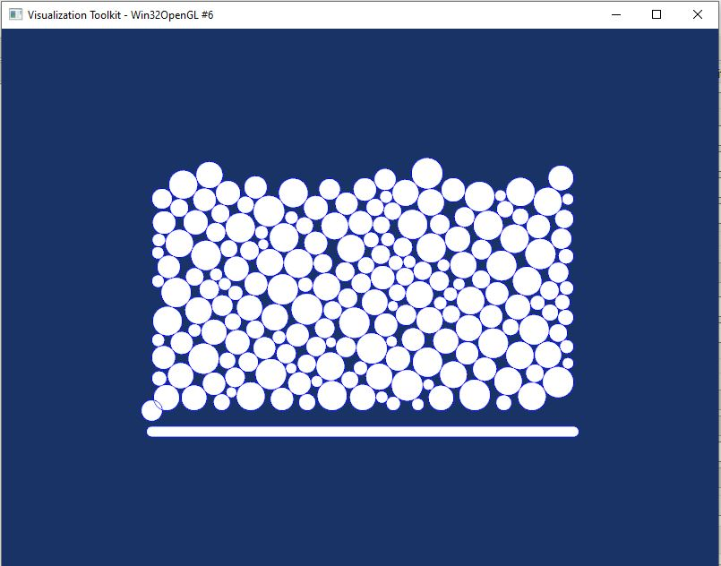

# Granulométrie et Dépôt

Cette section sert à génération de dépôts granulaires.

## Paramètres
- Nombre de particules à générer
- Distribution aléatoire des rayons entre `rmin` et `rmax`
- [x]Seed (reproductibilité)
- Type de conteneur : Box2D, Disk2D, Couette2D, Drum2D
- Avatar modèle (sélectionné parmi les avatars manuels)
- Couleur des particules
- [x]Option : créer murs autour (Box2D)
- Option : stocker dans groupe nommé

## Fonctionnement
1. Utilise la fonction `granulo_Random` pour la ditribution
2. Utilise les fonctions `depositInBox2D`, `depositInDisk2D`, `depositInCouette2D` et `depositInDrum2D`

## Exemple
Cet exemple n'est pas concret mais montre seulement les proprétés de vos granulométries
| Champ | Description | Exemple |
|-------|-------------|---------|
| **Nombre de particules** | Nombre total de particules à générer | `200` |
| **Rayon Min (rmin)** | Rayon minimum des particules | `0.05` |
| **Rayon Max (rmax)** | Rayon maximum des particules | `0.15` |

| Conteneur | Paramètres | Description |
|-----------|------------|-------------|
| dans mon cas **Box2D** | `lx`, `ly` | Boîte rectangulaire |    
| **Disk2D** | `r` | Disque circulaire |
| **Couette2D** | `rint`, `rext` | Anneau (cellule de Couette) |
| **Drum2D** | `r` | Tambour rotatif |

#### 3. Propriétés Physiques

| Champ | Description |
|-------|-------------|
| **Matériau** | Matériau à appliquer aux particules |
| **Modèle** | Modèle physique (généralement `Rxx2D`) |
| **Couleur** | Couleur des particules (`BLUEx`, `REDxx`, etc.) |
| **Type d'avatar** | Avatar modèle pour la forme des particules (rigidDisk)  |

IL ne vous reste de cliquer sur le bouton 'Générer de dépôt'

Le rendu de mon modèle, 
