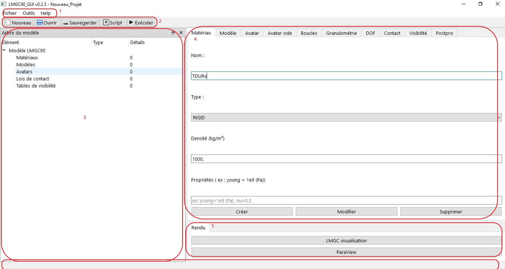

# Introduction à l'interface de LMGC90_GUI

LMGC90_GUI est une interface graphique moderne et intuitive conçue pour faciliter la création de modèles numériques avec le module pré-processeur de **LMGC90**.

L'interface est organisée de manière claire et ergonomique pour accompagner l'utilisateur du début à la fin du processus de modélisation : création des éléments, assemblage, conditions aux limites, post-traitement, puis génération des fichiers de simulation.

Voici une vue d'ensemble des différentes parties de l'interface.

## Fenêtre principale

L'interface est divisée en **quatre zones principales** :

1. **Menu**
2. **Barre d'outils** (en haut)
3. **Arbre du modèle** (à gauche)
4. **Onglets de création** (centre haut)
5. **Zone de rendu** (centre bas)
6. **Barre d'état** (en bas)

### 1. Menu et Barre d'outils

#### Menu
- **Fichier** :
  - Nouveau (Ctrl+N)
  - Ouvrir (Ctrl+O)
  - Sauvegarder (Ctrl+S)
  - Sauvegarder sous... (Ctrl+Shift+S)
  - Quitter (Ctrl+Q)
- **Outils** :
  - Options (Unités)
  - Définir variables dynamiques
- **Help** :
  - À propos

#### Barre d'outils
Raccourcis visuels pour les actions les plus fréquentes :
- Nouveau projet
- Ouvrir projet
- Sauvegarder projet
- Générer script Python
- Exécuter script Python
- Générer Datbox (nouveau en v0.2.6)

### 2. Arbre du modèle (à gauche)

Zone fixe en forme de dock contenant l’**arborescence complète du modèle en cours**.

#### Sections affichées :
- **Matériaux** (nombre)
- **Modèles** (nombre)
- **Avatars** (nombre total)
- **Groupes d'avatars** (boucles, granulométrie)
- **Lois de contact**
- **Tables de visibilité**

Fonctionnalités :
- Clic sur un élément → ouvre l’onglet correspondant avec les valeurs chargées
- Permet la sélection rapide pour modification/suppression
- Vue hiérarchique claire de tout le projet

### 3. Onglets de création (zone centrale supérieure)

Zone principale de travail avec des onglets dédiés à chaque étape de modélisation :

- **Matériau** : création et gestion des matériaux
- **Modèle** : définition des modèles physiques et éléments
- **Avatar** : création de corps rigides simples (disque, polygone, mur, etc.)
- **Avatar vide** : création avancée avec contacteurs multiples
- **Boucles** : génération paramétrique (cercle, grille, ligne, spirale, manuel)
- **Granulométrie** : génération de dépôts avec distribution de tailles
- **DOF** : conditions aux limites (translation, rotation, vitesses imposées)
- **Contact** : lois d’interaction
- **Visibilité** : tables de détection
- **Postpro** : commandes de sortie (énergie, suivi de corps, etc.)

Chaque onglet contient les champs nécessaires et les boutons **Créer / Modifier / Supprimer**.

### 4. Zone de rendu (zone centrale inférieure)

Partie dédiée à la visualisation et aux sorties.

#### Boutons disponibles :
- **LMGC visualisation** : lance la visualisation intégrée avec `pre.visuAvatars()`
- **ParaView** : ouvre automatiquement les fichiers de sortie dans ParaView (rigids.pvd)

Cette zone s’active après exécution d’une simulation.

### 5. Barre d'état (en bas)

Affiche des messages d'information sur l'état des opérations en cours.

---

LMGC90_GUI est conçue pour être **intuitive**, **puissante** et **entièrement visuelle**, tout en conservant la pleine compatibilité avec les scripts Python traditionnels de LMGC90.

Prochaines sections : guide détaillé de chaque onglet.