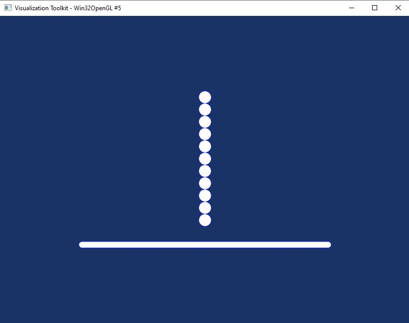

# Boucles Paramétriques

En sorte, c'est comme une répétion d’avatars identiques sous différentes formes.

## Types de boucles
Vous avez plusieurs formes : 
- Cercle
- Grille
- Ligne
- Spirale
- Manuel (création progressive)

## Paramètres
Il vous suffit seulement de remplir les champs pour chaque forme :  
- Avatar modèle à répéter : rigidDisk, etc.
- Nombre d'avatars . répéter
- Rayon pour la forme circle / pas gille et ligne  / offsets (X et Y)
- Option : stocker dans une liste nommée 
## exemple 
Dans mon exemple je vais créer une répétirion linàire de RigidDisk, suivant l'axe y, 
- Après avoir créer une fondation RigidJonc, 
- Type de bpoucle : linéaire, 
- Nombre : 10,
- Avatar à répéter : rigidDisk, 
- Pas : 0.2 (rayon disk égal à 0.1)
- j'ai coché la case (inverser la direction),
- Offset Y égal 0.2,
- j'ai coché la case stocker dans un groupe  : granulats_disks

Pour avoir le rendu de mon modèle je clique simplement sur le bouton 'LMGC90 visualisation'

## Utilisation
Idéal pour générer des murs, empilements réguliers d'avatars,

