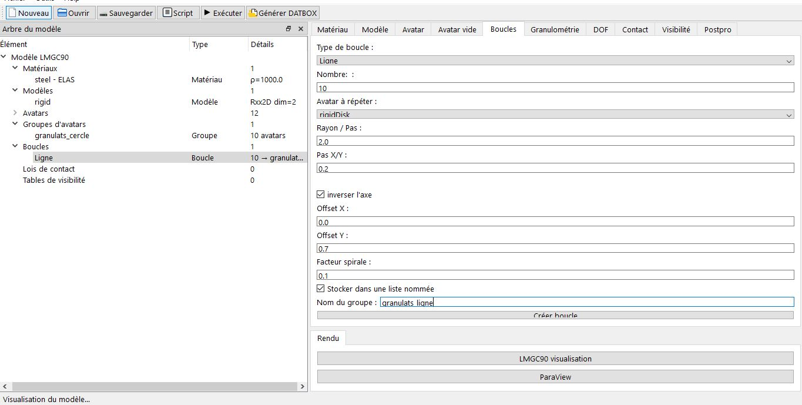

# Boucles Paramétriques

En sorte, c'est comme une répétion d’avatars identiques sous différentes formes.

## Types de boucles
Vous avez plusieurs formes : 
- Cercle
- Grille
- Ligne
- Spirale
- Manuel (création progressive)

## Paramètres
Il vous suffit seulement de remplir les champs pour chaque forme :  
- Avatar modèle à répéter : rigidDisk, etc.
- Nombre 
- Rayon pour la forme circle / pas gille et ligne  / offsets (X et Y)
- Option : stocker dans une liste nommée : 

## Utilisation
Idéal pour générer des murs, empilements réguliers d'avatars,

