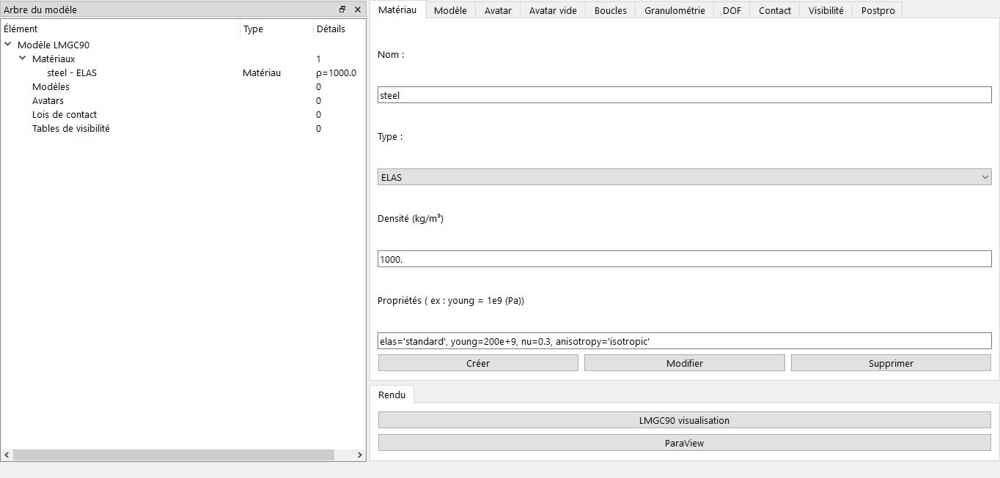
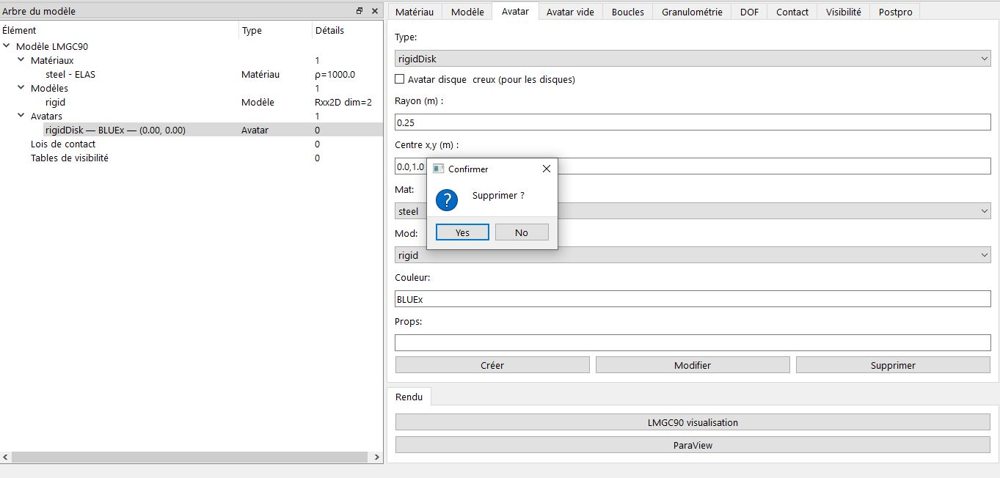

# Création d'un Matériau

Cette section explique comment créer et configurer un matériau dans LMGC90_GUI.

## Interface
- Onglet **Matériau** vous sert à créer votre matériau,
- Champs principaux :
  - **Nom** : Nom unique du matériau (maximum 5 caractère ex: `TDURx`, `steel`)
  - **Type** : Liste déroulante avec les types supportés
  - **Densité** : Valeur en kg/m³ (en SI)
  - **Propriétés** : Champ texte pour paramètres avancés pour chaque matériau

## Types de matériaux disponibles
Vous pourriez créer différents types de matériaux, ceux qui sont inclus sont :
- **RIGID** : Corps rigide (densité obligatoire)
- **ELAS** : Élastique linéaire isotrope
- **ELAS_DILA** : Élastique avec dilatation thermique
- **VISCO_ELAS** : Viscoélastique
- **ELAS_PLAS** : Élastoplastique
- **THERMO_ELAS** : Thermoélastique
- **PORO_ELAS** : Poroélastique

## Exemple de création
1. Sélectionnez le type (ex: ELAS), 
2. LMGC90_GUI vous chargera automatiquement les paramètres de ce matériau, il vous suffira seulement de modifier les valeurs dans le champs propriétés  (ex acier):
   - elas='standard', young=200e+9, nu=0.3, anisotropy='isotropic' 
3. Cliquez ensuite sur bouton **Créer**

## Astuces
- Le champ Propriétés accepte la syntaxe Python-like
- Utilisez les variables dynamiques si définies (menu Outils -> définir variables dynamiques)
- Faites attention aux matériaux choisis pour les éléments rigides du code LMGC90

## Modification/suppression
Vous avez aussi la possibilité de modifier ou de supprimer un matériau, pour cela sur l'onglet **Arbre du modèle**, tout d'abrod il faut sélectionner l'avatar, toutes ses données seront chargés ensuite, il vous suffit seulement de modifier vos nouvelles valeurs (rayon : 0.25, coordonnées : [0.0, 1.0]), puis de cliquer sur le bouton 'Modifier', une boite de dialogue s'ouvre pour confirmer la suppression ou de garder l'ancien avatar et d'en rajouter un nouveau (modifié)

