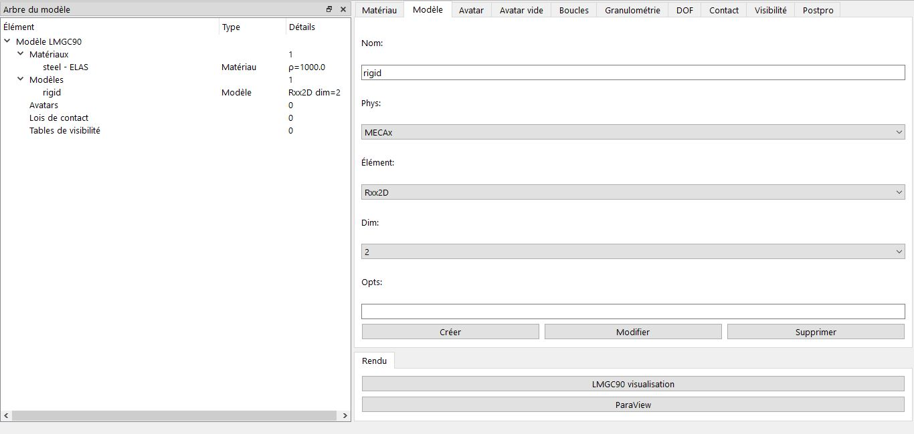

# Création d'un Modèle

Le modèle définit la physique et la discrétisation des corps avec des éléments finis. Les rigides sont représentés par des éléments en point.

## Interface
- Onglet **Modèle**
- Champs :
  - Nom : qui est une suite maximum de cinq caractères
  - Physique : (seulement 'MECAx' qui est implémenté)
  - Élément : (type de formulation)
  - Dimension : (seulement en 2D)
  - Options : (kinematic, formulation, etc.) qui dépend de l'élément choisit

## Éléments disponibles
### 2D
- Rxx2D (rigide)
- T3xxx, Q4xxx, T6xxx, Q8xxx, Q9xxx, BARxx

### 3D
- Rxx3D (rigide)
- H8xxx, SHB8x, H20xx, SHB6x, TE10x, DKTxx

## Options avancées
- kinematic : small / large
- formulation : UpdtL / TotaL
- mass_storage : lump_ / coher
- anisotropy : iso__ / ortho
- external_model

## Exemple
Dans l'onglet 'Modèle' choisissez : 
1. Nom : `rigid`
2. Élément : `Rxx2D`
3. Dimension : `2`
4. Cliquez ensuise sur le bouton *Créer*

